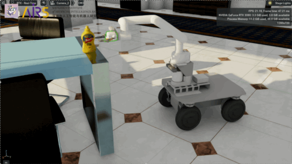

# airseai_sim
**The airseai_sim simulation environment is built based on Isaac Sim. Through the ROS2 interface, modules of the airseai can be developed and validated within this foundational environment.**



## Load airseai_sim Model
1. Install [Isaac Sim 4.2](https://docs.omniverse.nvidia.com/isaacsim/latest/installation/install_workstation.html)
2. Open USD file
> Open > Find "airseai/airseai_sim/airseai/airsbot2_manipulator_ros2_office.usd" > Open File

## airseai_sim API Overview
1. Subscribed Topics
* `/cmd_vel`: Subscribes to the velocity command topic, used to control the robot's movement via linear and angular velocity commands.
* `/joint_command`: Subscribes to joint command messages, allowing control of the robotic arm.

2. Published Topics
* `/Imu_data`: Publishes data from the IMU, including acceleration and angular velocity information.
* `/camera/camera/color/image_raw`: Publishes raw color images captured by the eye-in-hand camera.
* `/camera/camera/aligned_depth_to_color/image_raw`: Publishes rectified depth images from the eye-in-hand camera's depth sensor.
* `/odom`: Publishes odometry data, including the robot's position and orientation.
* `/rslidar_points`: Publishes point cloud data captured by the LiDAR sensor.
* `/zed/zed_node/depth/depth_registered`: Publishes the registered depth image of the navigation camera.
* `/zed/zed_node/left/image_rect_color`: Publishes rectified color images from the left lens of the navigation camera.
* `/zed/zed_node/right/image_rect_color`: Publishes rectified color images from the right lens of the navigation camera.

## Usage of airseai_sim and airseai Modules
1. Navigation and object grasping
* Use the airseai_localization package to localize the robot in the simulation environment
```
ros2 launch airseai_localization airseai_localization_gt_sim.launch.py
```
* Use the airseai_navigation package for navigating the robot and controlling its motion
```
ros2 launch airseai_navigation airseai_navigation_sim.launch.py
```
* Run the airseai_perception package to identify and segment objects in the environment
```
ros2 launch airseai_perception run_airseai_perception_node.launch.py
```
* Use the airseai_grasp package to plan and control the robot’s manipulator
```
ros2 launch airseai_grasp grasp.launch.py
```

2. Build object map
* First, launch airseai_localization for localization
```
ros2 launch airseai_localization airseai_localization_gt_sim.launch.py
```
* Then, launch airseai_perception for object recognition and segmentation
```
ros2 launch airseai_perception run_airseai_perception_node.launch.py
```
* Finally, launch airseai_object for building the object map
```
ros2 launch airseai_object run_object_map_node_sim.launch.py
```
